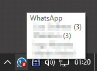

# WhatsMissing

WhatsMissing is a launcher that provides some extensions to the official Windows WhatsApp Client.

  

  

### Features
- Some of WhatsApp's colors can be changed
- WhatsApp can be minimized to the notification area using the close button/escape key
- Notification icon indicates whether new messages were received
- WhatsApp can be configured to be always on top
- Easy installation/uninstallation without modifications to WhatsApp's original files

### Requirements
- [WhatsApp Client](https://www.whatsapp.com/download) (64 and 32 Bit supported)

### Installation
Download the installer from "Releases" and run it. WhatsMissing will install itself to %APPDATALOCAL%\WhatsMissing, configuration and resource cache will be located at %APPDATA%\WhatsMissing after first start.

WhatsApp shortcuts in the start menu/taskbar/desktop are modified by the installer to start the WhatsMissing executable which in turn starts WhatsApp with the extensions.

Complete uninstallation is possible using "Programs and Features".

### How to use
When WhatsApp is running right click the notification icon to open the settings dialog or toggle "Always on top". The menu entries displayed in the notification icon context menu are also accessible using the title bar context menu.

### Building
Install Lazarus IDE and the tools to crosscompile, open the project files and build it. To use the build script "Build.bat" you need to edit its 4th line.

### Thanks
- [Lazarus IDE](https://www.lazarus-ide.org)
- [Free Pascal](https://www.freepascal.org)
- [Font Awesome](https://fontawesome.com)
- [MahdiSafsafi](https://github.com/MahdiSafsafi)
